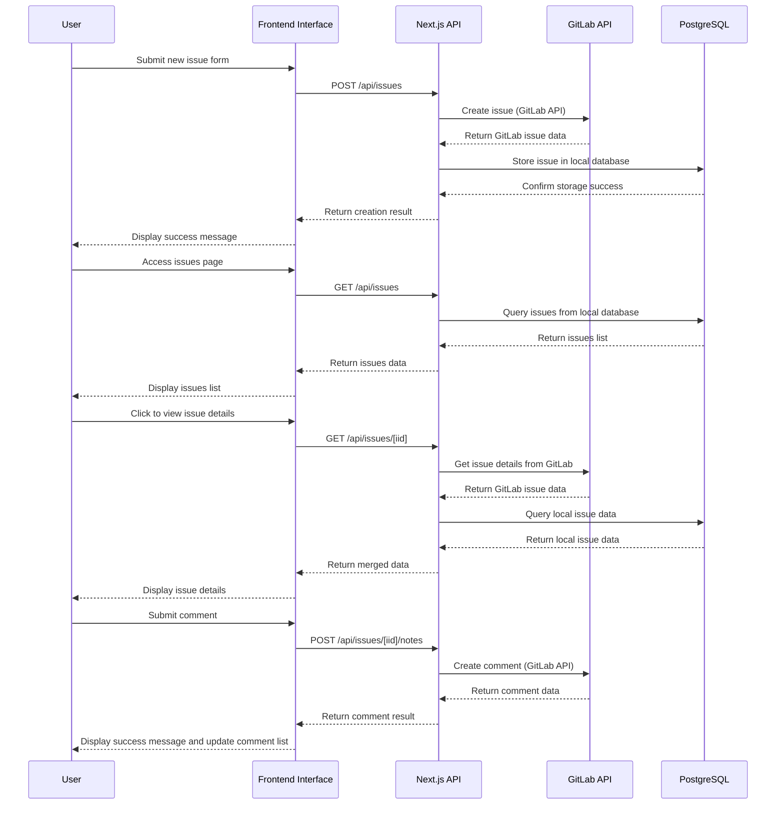

# KiCad Issue CN - Project Overview

## Project Introduction

KiCad Issue CN is a lightweight fullstack GitLab issue bridge built with Next.js and Prisma. It serves as an interface that allows users to create, view, and manage GitLab issues while storing issue information in a local PostgreSQL database.

## Core Features

* 📝 **Create issues** - Users can submit new issues through the web interface
* 📋 **View issues list** - Display all created issues
* 📄 **View issue details** - View detailed information for individual issues
* 💬 **Reply to issues** - Add comments to issues
* 🔄 **Sync with GitLab** - Sync data with GitLab via GitLab API
* 🐳 **Docker deployment** - Support for containerized deployment with Docker
* 🗄️ **PostgreSQL storage** - Use Prisma ORM to interact with PostgreSQL database

## Technology Stack

* **Frontend Framework**: Next.js (App Router)
* **Programming Language**: TypeScript
* **Styling Framework**: Tailwind CSS
* **ORM Tool**: Prisma
* **Database**: PostgreSQL
* **Containerization**: Docker

## Workflow



## API Routes

| Method | Endpoint | Description |
|--------|----------|-------------|
| POST | /api/issues | Create a new issue |
| GET | /api/issues | List all issues |
| GET | /api/issues/[iid] | Get issue details |
| GET | /api/issues/[iid]/notes | List issue comments |
| POST | /api/issues/[iid]/notes | Add a comment |

## Data Model

### Issue Model

| Field | Type | Description |
|-------|------|-------------|
| id | Int | Local database ID (auto-increment) |
| gitlabIid | Int | Issue ID on GitLab (unique) |
| title | String | Issue title |
| description | String | Issue description (optional) |
| labels | String | Issue labels (optional, comma-separated) |
| username | String | Creator username |
| createdAt | DateTime | Creation time |

## Deployment

### Docker Compose (Recommended)

Deploy using the `docker-compose.yml` file, which includes PostgreSQL database and application services.

### Environment Variables

The project requires the following environment variables:

- `GITLAB_TOKEN`: GitLab personal access token
- `GITLAB_PROJECT_ID`: GitLab project ID
- `GITLAB_BASE_URL`: GitLab API base URL (default: https://gitlab.com/api/v4)
- `DATABASE_URL`: PostgreSQL database connection string

## Development Flow

1. Install dependencies: `pnpm install`
2. Database migration: `pnpm prisma migrate dev`
3. Start development server: `pnpm dev`
4. Access: http://localhost:3000

## Production Build

```bash
pnpm build
pnpm start
```

## Summary

KiCad Issue CN is a clean and feature-complete GitLab issue management system that seamlessly integrates with GitLab through Next.js and Prisma. It provides a user-friendly interface for creating, viewing, and managing issues while ensuring data remains synchronized between the local database and GitLab.

The project uses modern frontend technology stack, supports Docker deployment, and is suitable as a lightweight issue management interface for GitLab projects, especially for scenarios requiring localized management and additional features.