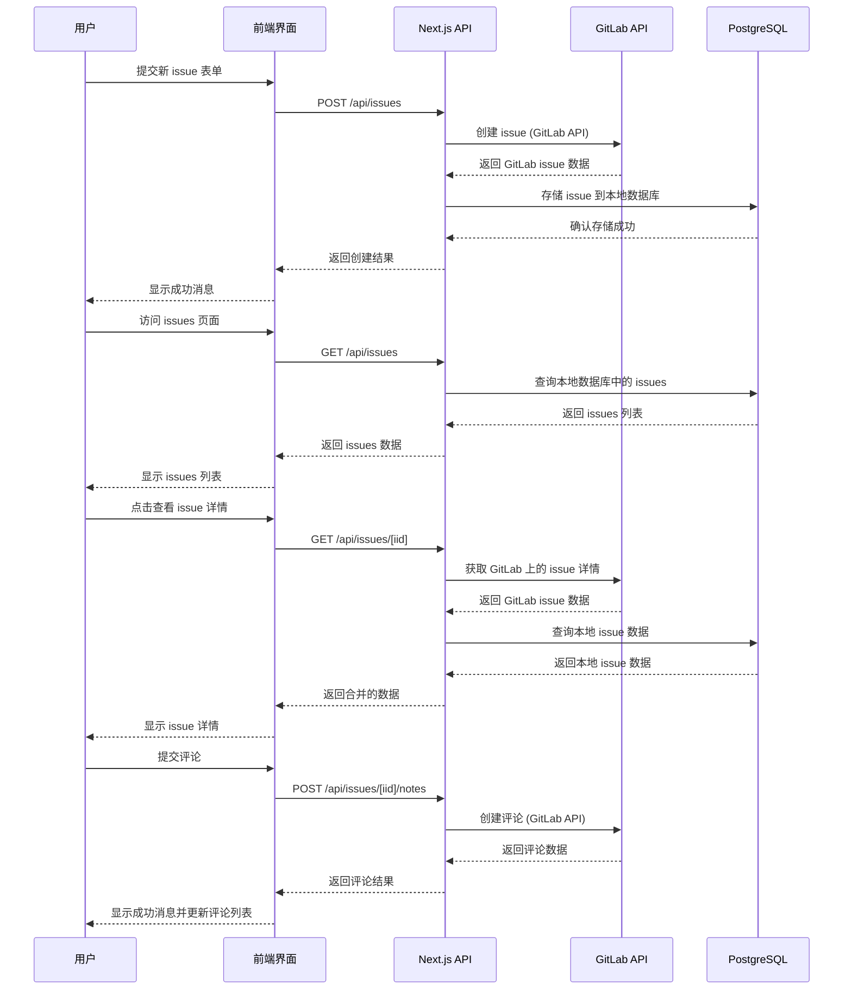

# KiCad Issue CN - 项目概述

## 项目简介

KiCad Issue CN 是一个轻量级的全栈 GitLab issue 桥接器，使用 Next.js 和 Prisma 构建。它作为一个界面，允许用户创建、查看和管理 GitLab 问题，同时在本地 PostgreSQL 数据库中存储问题信息。

## 核心功能

* 📝 **创建问题** - 用户可以通过 web 界面提交新的 issue
* 📋 **查看问题列表** - 显示所有已创建的 issue
* 📄 **查看问题详情** - 查看单个 issue 的详细信息
* 💬 **回复问题** - 对 issue 添加评论
* 🔄 **与 GitLab 同步** - 通过 GitLab API 与 GitLab 进行数据同步
* 🐳 **Docker 部署** - 支持 Docker 容器化部署
* 🗄️ **PostgreSQL 存储** - 使用 Prisma ORM 与 PostgreSQL 数据库交互

## 技术栈

* **前端框架**: Next.js (App Router)
* **编程语言**: TypeScript
* **样式框架**: Tailwind CSS
* **ORM 工具**: Prisma
* **数据库**: PostgreSQL
* **容器化**: Docker

## 工作流程



## API 路由

| 方法 | 端点 | 描述 |
|------|------|------|
| POST | /api/issues | 创建新 issue |
| GET | /api/issues | 列出所有 issues |
| GET | /api/issues/[iid] | 获取 issue 详情 |
| GET | /api/issues/[iid]/notes | 列出 issue 评论 |
| POST | /api/issues/[iid]/notes | 添加评论 |

## 数据模型

### Issue 模型

| 字段 | 类型 | 描述 |
|------|------|------|
| id | Int | 本地数据库 ID (自增) |
| gitlabIid | Int | GitLab 上的 issue ID (唯一) |
| title | String | Issue 标题 |
| description | String | Issue 描述 (可选) |
| labels | String | Issue 标签 (可选，逗号分隔) |
| username | String | 创建者用户名 |
| createdAt | DateTime | 创建时间 |

## 部署方式

### Docker Compose (推荐)

使用 `docker-compose.yml` 文件进行部署，包含 PostgreSQL 数据库和应用服务。

### 环境变量

项目需要以下环境变量：

- `GITLAB_TOKEN`: GitLab 个人访问令牌
- `GITLAB_PROJECT_ID`: GitLab 项目 ID
- `GITLAB_BASE_URL`: GitLab API 基础 URL (默认: https://gitlab.com/api/v4)
- `DATABASE_URL`: PostgreSQL 数据库连接字符串

## 开发流程

1. 安装依赖: `pnpm install`
2. 数据库迁移: `pnpm prisma migrate dev`
3. 启动开发服务器: `pnpm dev`
4. 访问: http://localhost:3000

## 生产构建

```bash
pnpm build
pnpm start
```

## 总结

KiCad Issue CN 是一个简洁而功能完整的 GitLab issue 管理系统，通过 Next.js 和 Prisma 实现了与 GitLab 的无缝集成。它提供了用户友好的界面来创建、查看和管理 issues，同时确保数据在本地数据库和 GitLab 之间保持同步。

该项目采用现代前端技术栈，支持 Docker 部署，适合作为 GitLab 项目的轻量级 issue 管理界面，特别是对于需要本地化管理和额外功能的场景。